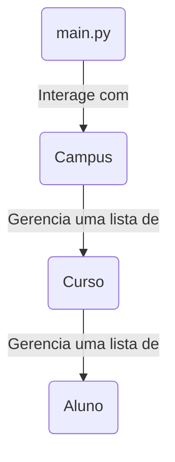

# 🏛️ Sistema de Gestão Acadêmica (CRUD em Python OOP)

**Status:** Projeto Acadêmico Concluído

Este é um projeto de console (CLI) focado em demonstrar os princípios da **Programação Orientada a Objetos (OOP)** em Python. A aplicação simula um sistema de gestão para uma universidade, permitindo o cadastro hierárquico de Campus, Cursos e Alunos.

O principal conceito de design explorado é a **Composição**, onde objetos mais complexos são "compostos" por objetos mais simples, criando uma hierarquia de dados robusta e encapsulada.

---

## 🚀 Funcionalidades Principais

O sistema é totalmente interativo e baseado em menus, com validação de entradas e tratamento de erros, permitindo um CRUD (Create, Read, Update, Delete) completo nos três níveis da hierarquia.

| Nível | Entidade | Funcionalidades |
| :--- | :--- | :--- |
| **Nível 1** | **Campus** | `[C]` Criar (com verificação de duplicatas)<br>`[R]` Listar todos<br>`[D]` Excluir (com verificação de segurança) |
| **Nível 2** | **Curso** | `[C]` Adicionar a um campus (com verificação de duplicatas)<br>`[R]` Listar cursos de um campus<br>`[D]` Remover (com verificação de segurança) |
| **Nível 3** | **Aluno** | `[C]` Adicionar a um curso (com verificação de duplicatas)<br>`[R]` Listar alunos de um curso<br>`[U]` Atualizar e-mail e semestre<br>`[D]` Remover de um curso |

---

## 🏛️ Arquitetura e Conceitos de OOP

O projeto foi intencionalmente modularizado para promover o **encapsulamento** (cada classe cuida de si) e a **clareza** (cada arquivo tem uma responsabilidade).

### Estrutura de Arquivos

```
/
├── main.py       # Ponto de entrada, interface do usuário (Menus)
│
├── campus.py     # Classe 'Campus' (Nível 1 - Gerencia Cursos)
│
├── curso.py      # Classe 'Curso' (Nível 2 - Gerencia Alunos)
│
└── aluno.py      # Classe 'Aluno' (Nível 3 - Guarda dados)
```

### Diagrama de Composição (Hierarquia)

A relação entre as classes não é de "Herança" (um Aluno não "é um" Curso), mas sim de **Composição** (um Curso "tem uma" lista de Alunos). Esta é a arquitetura central do projeto:



* **`main.py` (A Interface):** É o "orquestrador". Ele só conhece e conversa com a classe `Campus` e com a `lista_geral_campus`. Ele não sabe (e não precisa saber) como um `Aluno` é criado ou armazenado.
* **`campus.py` (O Gerente Geral):** Gerencia uma `lista_de_cursos`. É responsável por adicionar, listar e remover objetos `Curso`.
* **`curso.py` (O Gerente de Equipe):** Gerencia uma `lista_de_alunos`. É responsável por adicionar, listar, atualizar e remover objetos `Aluno`.
* **`aluno.py` (O Indivíduo):** A classe mais interna. Não gerencia nenhuma lista, apenas armazena seus próprios dados (`nome`, `matricula`, etc.).

### Por que Composição?

Usar composição em vez de herança torna o sistema muito mais flexível e lógico. O `Campus` não se importa *como* o `Curso` funciona internamente, ele apenas pede ao objeto `Curso` para se gerenciar (ex: `curso.listar_alunos()`). Isso é **encapsulamento**.

---

## 💻 Tecnologias Utilizadas

* **Python 3**
* **Programação Orientada a Objetos (OOP)**
* **Design Patterns:** Composição (Composition)
* **Ambiente de Console (CLI)**

---

## ▶️ Como Executar

1.  Garanta que o **Python 3** esteja instalado.
2.  Clone este repositório ou baixe os 4 arquivos `.py` (`main.py`, `campus.py`, `curso.py`, `aluno.py`) para o **mesmo diretório**.
3.  Abra seu terminal (Prompt de Comando, PowerShell, etc.).
4.  Navegue até o diretório onde os arquivos estão.
5.  Execute o arquivo `main.py`:

    ```bash
    python main.py
    ```

---

## 📋 Exemplo de Uso (Fluxo de Trabalho)

O sistema é hierárquico, então você deve criar as coisas de "cima para baixo".

```text
--- Sistema de Gestão - UFC ---
[1] Criar Novo Campus
[2] Listar todos os Campus
[3] Gerenciar um Campus (ver cursos)
[4] Excluir um Campus
[0] Sair do Sistema

Selecione uma opção: 1

Digite o nome do Campus: Pici
Digite a cidade do Campus: Fortaleza

--- Sistema de Gestão - UFC ---
...
Selecione uma opção: 3

Nome do Campus que deseja gerenciar: Pici

--- Gerenciando Campus: [Pici] ---
[1] Adicionar Curso
...
Selecione uma opção: 1

Nome do Curso: Ciência da Computação
Código do Curso (ex: AB01): CC01

... e assim por diante, até gerenciar os alunos.
```